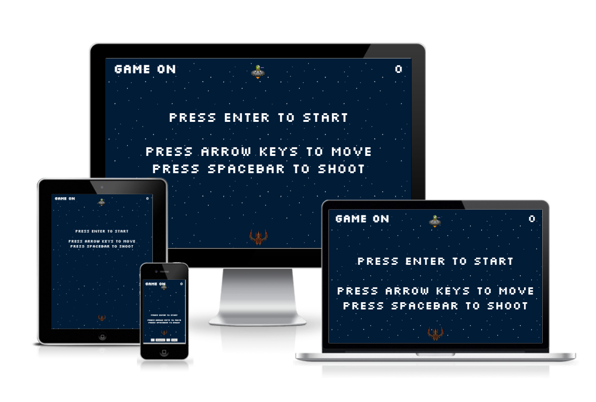
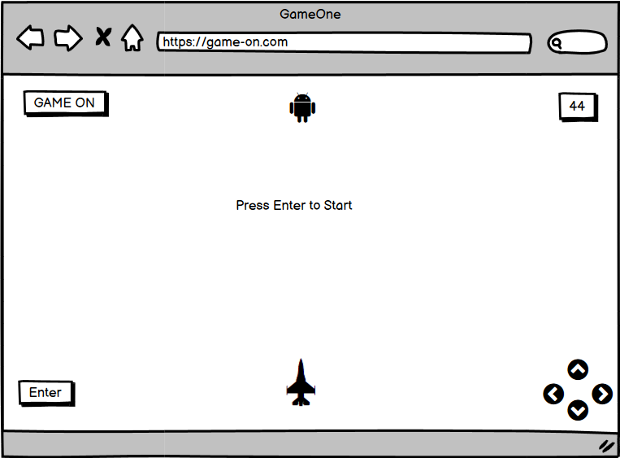
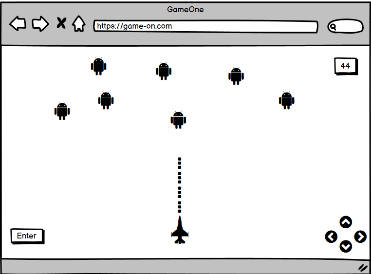
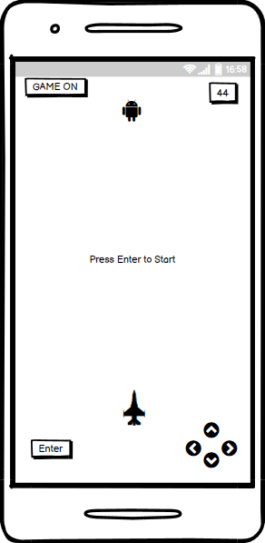
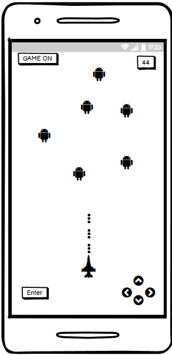
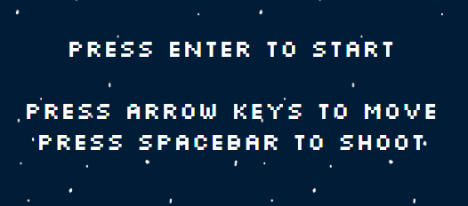
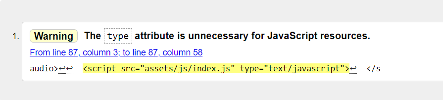
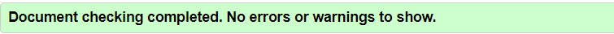

# **_GameOn_**

Game On is inspired by the 1978 shoot 'em up arcade game, Space Invaders, which was originally
developed by Tomohiro Nishikado. This version is an interactive game for 
the user to shoot bullets from a spacerocket at the invading space aliens. The player gains
points for each alien they hit. The game is aimed at all age groups and is designed to allow 
immediate access to the game upon pressing enter. The game is available using keyboard
for desktops and touch screen for tablet and mobile devices.

Link to live site - [Game On](https://toby7658.github.io/gameon/)

# Table of Contents

* [**User Experience UX**](<#user-experience-ux>)
    * [User Interaction](<#user-interaction>)
    * [User Stories](#user-stories>)
    * [Wireframe](<#wireframe>)
    * [Code Structure of Site](<#code-structure-of-site>)
    * [Typography](<#typography>)
    * [Colour Scheme](<#colour-scheme>)
    * [Game Characters](<#game-characters>)

* [**Existing Features**](<#existing-features>)
    * [Keyboard Arrows](<#keyboard-arrows>)

* [**Future Features**](<#future-features>)

* [**Technologies Used**](<#technologies-used>)
  * [HTML](#html)
  * [CSS](#css)
  * [Google Fonts](#google-fonts)
  * [Font Awesome Icons](#font-awesome-icons)
  * [balsamiq](#balsamiq)
  * [GitHub](#gitHub)
  * [Git](#git)
  * [Gitpod](#gitpod)
  * [Adobe Color](#adobe-color)
  * [Gimp](#gimp)
  * [Slack](#slack)
  * [Visual Studio](#visual-studio)
  * [volusion](#volusion) 
  * [pxhere](#pxhere)
  * [Google Maps](#google-maps)
  * [Youtube](#youtube)
  * [Code Institute](#code-institute)
  * [Google Images](#google-images)
  * [Grammarly](#grammarly)
 

* [**Testing**](<#testing>)

  * [Lighthouse](#lighthouse)
  * [WebPageTest](#webpagetest)
  * [W3Markup Validation Service](#w3markup-validation-service)
  * [W3CSS Validation Service](#w3css-validation-service)

* [**W3 Validation Results**](#w3-validation-results)
* [**Lighthouse Testing Desktop Results**](#lighthouse-testing-desktop-results)
* [**Lighthouse Testing Mobile Results**](#lighthouse-testing-mobile-results)
* [**Webpagetest**](#webpagetest)

* [**Bugs and Errors**](<#bugs-and-errors>)

* [**Deployment**](<#deployment>)
* [Forking the GitHub Repository](#forking-the-gitHub-repository)
* [Cloning the Github Repository](#cloning-the-github-repository)

* [**Credits**](<#credits>)

* [**Code Used**](<#code-used>)
  * [HTML](#html)
  * [CSS](#css)
  * [Java Script](#java-script)

* [**Acknowledgment**](<#Acknowledgment>)

# User Experience UX

## User Interaction
Game On is an interactive shooting game which allows the user to use the arrow keys and spacebar on their
keyboard to move and shoot aliens with a rocketship. The user can identify the hero ship at the bottom of the 
screen and can move left, right, up, down with the arrow keys and shoot using the spacebar. 
The user is provided with a splash alert upon opening the game, which instructs the user
to press ENTER TO START and following this, instructions to use the arrow keys to move and
spacebar to shoot. The user can view their score at the top right-hand-side of 
the screen and this increases in numbers as the user kills aliens; the aliens disappear once hit.
The user can identify the alien targets at the top of the screen; the aliens fall at random and multiply 
as they fall towards the ship. 
Sound has been placed on the end of the game which alerts the user when the game has ended and the user has lost. The game will end only when the user loses. Sound has been placed on the hit impact of the alien
which provides the user with a better experience as they progress through the game.

[Back to top](<#Table-of-Contents>)

## User Stories
* As a user, I want a retro game that that is set in space.
* As a user, I want to use my keyboard to direct the game hero character.
* As a user, I want a game which scores points as I play and interact.
* As a user, I want a game which is similiar to an old arcade game.
* As a user, I want to hear sound effects as I hit characters.
* As a user, I want to a game that I can play on touch screen small devices.

[Back to top](<#Table-of-Contents>)

## Wireframe
The mock-up for this project was created using [Balsamiq](https://balsamiq.com/wireframes/).

### Game Waiting screen for wide screen devise

### Game Play screen for wide screen devise

### Game Waiting screen for small screen devise

### Game Play for small screen devise

[Back to top](<#Table-of-Contents>)

# Code Structure of Site
The site is made up of one pages. It is constructed of the following languages:
1. * [Game page HTML](index.html)
2. * [Game page CSS](assets/css/style.css)
3. * [Game page Java Script](assets/js/index.js)

[Back to top](<#Table-of-Contents>)

# Typography
 The font aim for this game is to provide a retro arcade vibe.
 The font chosen is Silkscreen for the arcade style font and Sans-serif as a fall-back
 should Silkscreen nolonger be available. Fonts were taken from [Google Fonts](https://fonts.google.com/).
 
 

[Back to top](<#Table-of-Contents>)

# Colour Scheme
The colour scheme is inspired by the 1978 shooting game, Space Invaders. However, 
the aim was not to copy the original game but to create a similar template which requires a simple colour scheme.
The background [image](https://www.geeksforgeeks.org/html5-game-development-infinitely-scrolling-background/) of a dark navy space with distant stars was used to replace the original black screen. The text remains the original #FFFFFF. The Alien character, which are originally white, has been replaced with an image of an alien in a spaceship. The heroship, which was originally green, has been replaced by an image of a [rocketship](https://opengameart.org/art-search?keys=laser&page=2). 
The [bullets](https://opengameart.org/art-search?keys=laser&page=2) (or lasers) which shoot the aliens, is also an image used.

The colour scheme was guided by [Adobe Color](https://color.adobe.com/create/color-wheel) and [HTML CSS Color Picker](https://www.htmlcsscolor.com/).

# Game Colours:

[Back to top](<#Table-of-Contents>)

# Game Characters
As discussed, the aim of this game was to provide a similar style to the original Space Invaders
arcade game. The characters, however, have been updated. The Heroship has been replaced with a
more up-to-date rocketship and the alien invadors have been updated with an image of an alien in a spaceship.
The bullets (laser) image provides a more impressive shooting experience, albeit, continues to be inkeeping
with the arcade experience of the game.

## Keyboard Arrows
Tablet and phone screens are provided with touch screen buttons which allow the user
to navigate and play the game without the use of a keyboard. The 'arrow buttons' are aligned to 
the right, providing the user with directional movement, up, down, left, right, with use of their right thumb.
The left buttons, which consist of an 'enter button' and 'spacebar button', allows the user
to start the game and shoot with the left thumb. The aim for this alignment, is to allow the user
to play with minimum hand movement and maintain focus on the targets.

## Score
The score element is aligned to the right of the logo and is a permanent fixture throughout the game.
The user can see the score increase as they hit each alien with a bullet. The score will continue to
increase for the duration of the game play.

[Back to top](<#Table-of-Contents>)

## Logo
The logo is designed to be simple, yet memorable. In-keeping with arcade games of the past, the logo is made up of two short word choices that are intended to get an emotional reaction and evoke an energy to make a move.
The Silkscreen font, coupled with a white colour, is intended to stand-out against the navy background, however,
not to cause a distraction during game-play. The charaters of the game move behind the logo, to ensure visability
of the logo.

[Back to top](<#Table-of-Contents>)

## Future Features
Future features will include:
* The game will be a multiplayer game.
* The Rocketship (hero character) will have multiple lives before the game ends.
* The user will have a choice of characters, aliens, rocketship, laser type, to choose from before play.
* The user can change location (background), deep-space, earth sky, Mars sky, Venus sky.

[Back to top](<#Table-of-Contents>)

## Technologies Used
  * [HTML](https://en.wikipedia.org/wiki/HTML5) - HTML the most basic building block of the Web. This is the main language used to develop the site. 
  * [CSS](https://en.wikipedia.org/wiki/CSS) - CSS describes how HTML elements are to be displayed on screen. This has been used to develop the style of the site.
  * [Java Script](https://en.wikipedia.org/wiki/JavaScript) - JavaScript was used for to creating dynamic and interactive content of the game.
  * [Google Fonts](https://fonts.google.com/) - Google Fonts is a directory of font families which was incorporated during the development of the site.
  * [balsamiq](https://balsamiq.com/wireframes/?gclid=CjwKCAjwi8iXBhBeEiwAKbUoferdHodwIX8rhZQq6jDFB9i1ffpeC04Iv0ROTwgZLHrOEP1rmCqzjhoCUsMQAvD_BwE) - Balsamiq was used to create a mock-up wireframe for large and small screen devices.
  * [GitHub](https://github.com/about) - Github is used to host the source code for the site.
  * [Git](https://git-scm.com/) - Git is used to manage and keep track of the source code history throughout development. 
  * [Gitpod](https://www.gitpod.io/) - Gitpod creates connections between Gitpod and GitHub accounts. Gitpod continuously builds git branches to facilitate the coding process.
  * [Adobe Color](https://color.adobe.com/create/color-wheel) - Adobe Colour has been used to navigate colour charts for the site during development. 
  * [Slack](https://slack.com/intl/en-ie/) - Slack was utilized by seeking advice and knowledge from students and mentors.
  * [Visual Studio](https://visualstudio.microsoft.com/) - Visual Studio was used in the very early phase to practice Javscript prior to github.
  * [Youtube](https://www.youtube.com/) - Youtube was ues to view multiple Javascript tutorials.
  * [Code Institute](https://codeinstitute.net/ie/) - Influence taken for all Javascript from Love Math module available via the Programme Overview.
  * [HTML CSS Color Picker](https://www.htmlcsscolor.com) - This site was accessed to assist with defining colour.
  * [Grammarly](https://app.grammarly.com/) - This site was used to complete a spell check throughout the site and readme file.

[Back to top](<#Table-of-Contents>) 
 
## Testing
- [Lighthouse](https://chrome.google.com/webstore/detail/lighthouse/blipmdconlkpinefehnmjammfjpmpbjk?hl=en)
- [W3Markup Validation Service](https://validator.w3.org/)
- [W3CSS Validation Service](https://jigsaw.w3.org/css-validator/)

## W3 Validation Results:
* Game Page html - [Error Free Home Page](/assets/documentation/w3-error-removed.png)
* CSS - [Error Free CSS](/assets/documentation/w3-css-errorfree.png)

## Lighthouse Testing Desktop Results:
* Game Page Html - [Lighthouse Validation Home Page](/assets/documentation/lighthouse-mobile.png)

## Lighthouse Testing Mobile Results:
* Game Page html - [Lighthouse Validation Home Page](/assets/documentation/lighthouse-mobile.png)

Chrome - 
Firefox - 

[Back to top](<#Table-of-Contents>)

## Bugs and Errors
1. When validating via W3 for HTML, the below warning appeared. This was resolved by removing the 'Type' 
attribute for the JavaScript resource.

Result after removing 'Type' attribute:

 [Back to top](<#Table-of-Contents>)

## Deployment
1. Access *[Github](https://github.com/)* by signing into an account
2. Access the Repository on the top-right-hand corner of the screen
3. Select the Repository required from the list
4. Click 'Settings' on the menu tab
5. On the left-hand-side of the next page, click 'Pages'
6. Under source, select branch: main, folder: root, and then click save. 
7. Once saved, the site will take time to refresh while it goes public. 
8. A link will appear stating (eg. of my account): Your site is live at https://toby7658.github.io/History-Onics/

## Forking the GitHub Repository 
By forking the GitHub Repository, a copy of the repository can be viewed or amended without affecting the original repository.
1. Log into GitHub to access the GitHub Repository,
2. At the top-right-hand side of the screen, locate "Fork",
3. Click on the "Fork" tab,
4. You now have a copy of the original repository in your GitHub account.

## Cloning the Github Repository 
1. Log into GitHub to access the GitHub Repository,
2. Under the settings button, click on the tab "Code",
3. This will open a dropdown box,
4. To clone using HTTPS, copy the link provided under this tab,
5. Access the desired IDE (eg. Visual Studio),
6. Type git clone, followed by the copied URL,
7. Press enter - this has now create your clone in the desired IDE.

[Back to top](<#Table-of-Contents>)

## Credits

* Mentor support and guidance from *[Jack Wachira](https://github.com/iamjackwachira)*.
* Facilitator and support from *[Kenan Wright](https://github.com/KenanCarlWright/KenanCarlWright)*.
* Facilitator and support from *[Kasia Bogucka](https://github.com/bezebee)*.
* W3C School JavaScript Tutorial *[W3C School JavaScript Tutorial](https://www.w3schools.com/js/default.asp)* - Used for additional learning around the over-all basics of JavaScript.
* Markdown Guide *[Markdown Guide](https://www.markdownguide.org/basic-syntax/)* - This was used to understand the basic syntax for Markdown.
* Youtube *[Space Shooter Game Tutorial](https://youtu.be/mwl95yvl-n0)* - This tutorial was used as a template to understand where to use the correct syntax - this was one of the main sources for creating the game.
* Youtube *[Youtube - Space Invaders Tutorial](https://youtu.be/MCVU0w73uKI)* - Used to learn about different ways to create syntax.
* Youtube *[Youtube - Space Invaders Tutorial](https://youtu.be/qCBiKJbLcFI)* - Used to learn what syntax to use.
* Youtube *[Youtube - JavaScript Tutorial for beginners](https://www.youtube.com/watch?v=W6NZfCO5SIk)* - Used to learn about syntax throughout.
* Youtube *[Youtube - Shooter Game Tutorial](https://youtu.be/gCa0z4B-CRo)* - Used to learn what syntax to use throughout.
* Youtube *[Youtube - Javascript Animation](https://youtu.be/pyhb8Y9qKUI)* - Used to learn what syntax to use throughout.
* Youtube *[Youtube - How to Shoot Bullets ](https://youtu.be/i7FzA4NavDs)* - Used to learn what syntax to use throughout.
* Youtube *[Youtube - JavaScript from Scratch](https://youtu.be/fi4E40kOGGM)* - Used to learn what syntax to use throughout.
* Fwait.com *[Arrow Keys & EventListener](https://www.fwait.com/how-to-move-an-object-with-arrow-keys-in-javascript/)* - Used to learn how to move arrow keys.
* StackOverflow *[document.getElementById](https://stackoverflow.com/questions/7396597/html-5-canvas-getelementbyid-returns-null-undefined)* - Used to learn about document.getElementById.
*  StackOverflow *[LetsPlay Function](https://stackoverflow.com/questions/17200399/terminate-function-execution-using-confirm)* - Used to learn about function LetsPlay().
*  W3School *[Variables and Evaluations](https://www.w3schools.com/js/js_syntax.asp)* - Assisted with creating variables and evaluation.
* Javapoint.com *[SetInterval](https://www.javatpoint.com/javascript-setinterval-method#:~:text=%E2%86%92%20%E2%86%90%20prev-,JavaScript%20setInterval()%20method,clearInterval()%20method%20is%20called)* - Assisted with setInterval for loop.
* GeekForGeeks *[parseInt](https://www.geeksforgeeks.org/javascript-parseint-function/#:~:text=The%20parseInt()%20function%20is,number%20to%20a%20decimal%20number)* - Assisted with using parseInt() function.
* W3School *[inner.HTML ](https://www.w3schools.com/jsref/prop_html_innerhtml.asp)* - Assisted with learning syntax using InnerHTML.
* TowardsDev *[SpaceShooter Game Tutorial](https://towardsdev.com/space-shooter-game-e48fbe04630a)* - Step by step how to Guide how to create a shooting game. 
* W3School *[Game Tutorial](https://www.w3schools.com/graphics/game_images.asp)* - Used to learn about StartGame() function.
* OpenGameArt.org *[Game Art](https://opengameart.org/art-search?keys=laser+bullet)* - Used to source character images for game.
* W3School *[HTML DOM](https://www.w3schools.com/js/js_htmldom.asp)* - Used to to get and change HTML elements.
*  *[]* - Used to learn about 
*  *[]* - Used to learn about 
*  *[]* - Used to learn about 
*  *[]* - Used to learn about 
*  *[]* - Used to learn about 
*  *[]* - Used to learn about 
*  *[]* - Used to learn about 
*  *[]* - Used to learn about 
*  *[]* - Used to learn about 

* Github *[Github Markdown Cheatsheet](https://github.com/adam-p/markdown-here/wiki/Markdown-Cheatsheet)* - This information assisted with understanding the syntax of Markdown.

 [Back to top](<#Table-of-Contents>)

## Code Used
 * [HTML](https://en.wikipedia.org/wiki/HTML5)
 * [CSS](https://en.wikipedia.org/wiki/CSS)
 * [Java Script](https://en.wikipedia.org/wiki/JavaScript)

 [Back to top](<#Table-of-Contents>)

## Acknowledgment
Many thanks to my Mentor *[Jack Wachira](https://github.com/iamjackwachira)* for providing solid guidance
and support. Thanks to Code Institute for giving me such an amazing opportunity to develop a new career
in such a supportive environment. Thanks to the community on Slack who are an ongoing wealth of information and motivation. 

[Back to top](<#Table-of-Contents>)